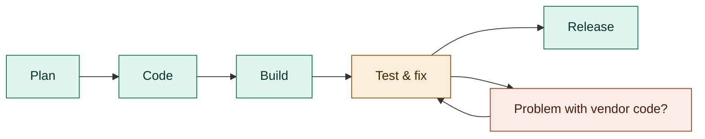
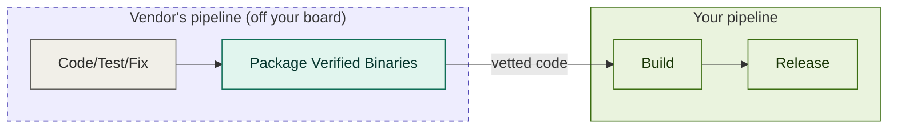

# Mermaid Test Page

This is a test page to isolate and iterate on the whitepaper diagrams.

## Diagram 1A: Traditional SDLC: Find issues before release

!!! danger "Cost to Fix Rises Later ⟶"
    Remediation costs increase significantly in the later stages of the lifecycle (Test & Release). Detecting and fixing issues earlier (shift left) is highly cost-effective.

## Diagram 1B: Upstream Verified Code: Shift issues off your board

## Diagram 2: 14-Day CVE Crisis Remediation Timeline (Gantt Chart)

```mermaid
---
config:
  theme: base
  useMaxWidth: true
  themeVariables:
    taskBkgColor: '#EAF3DE'
    taskBorderColor: '#3B6D11'
    taskTextColor: '#173404'
    activeTaskBkgColor: '#FAEEDA'
    activeTaskBorderColor: '#854F0B'
    activeTaskTextColor: '#412402'
    critBkgColor: '#FAECE7'
    critBorderColor: '#993C1D'
    critTextColor: '#4A1B0C'
    todayMarkerColor: '#d97706'
  gantt:
    useWidth: 1200
    leftPadding: 280
    fontSize: 16
    sectionFontSize: 16
    barHeight: 35
    barGap: 10
---
gantt
    dateFormat  X
    axisFormat %s days
    section CVE Timeline
    Phase 1 - Sourcing & Identification           :active, id1, 0, 5
    Phase 2 - Verifying & Rebuilding               :crit, id2, after id1, 10
    Phase 3 - Legal, Compliance & Audit            :id3, after id2, 14
```

