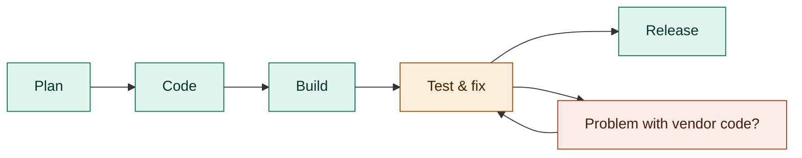
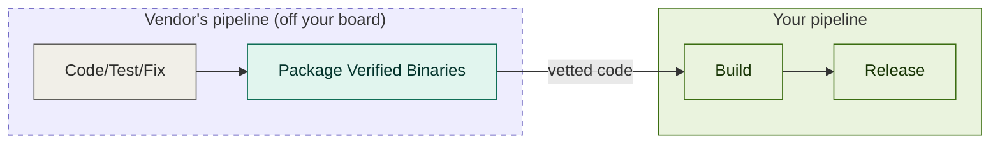

  Whitepaper & Executive Guide
  <h1>Securing the Foundation of Modern Infrastructure</h1>
  
A Strategic supply chain security & compliance blueprint for Enterprise Infrastructure & Compliance Managers navigating EU CRA & SLSA Level 3 requirements.

### Executive Summary: Securing the Foundation of Modern Infrastructure

In enterprise infrastructure, the most critical components are the ones nobody notices until a crisis hits. As the upstream maintainers of YAML, we understand the exhausting reality you face as an infrastructure and compliance manager: executives rarely care about foundational linchpins until they break. You are tasked with securing deeply embedded, rarely seen open-source dependencies across your entire technology stack, often battling limited financial and human resources to mitigate risks and meet strict regulatory mandates.

It is impossible to discuss this resource exhaustion without addressing the elephant in the room: AI-generated code. Whether your organization views generative coding assistants as a triumph of engineering velocity or a liability of unvetted technical debt, one observable fact is undeniable—they create a massive amount of noise. By drastically lowering the barrier to committing code, these tools inadvertently multiply the volume of deeply embedded third-party dependencies sprawling across the enterprise stack. This rapid code expansion acts as a threat multiplier, triggering massive false-positive alert noise from standard scanners and forcing security teams to spend 30% to 40% of their triage time manually verifying if a flagged library is actually exploitable. We know the pressure of managing these invisible, noisy layers, and the YAML Enterprise Sustainability (YES) Program is designed to actively share that burden.

Under new regulatory mandates like the EU Cyber Resilience Act (CRA) and US Executive Order 14028, organizations bear strict legal liability for the safety and continuous maintenance of all embedded open-source components. For compliance managers and engineering directors, the unmanaged status quo is no longer sustainable. When a vulnerability is disclosed, the unmanaged remediation cycle typically spans 10 to 14 days due to localized search friction and unverified build chains. At a blended developer rate, a single multi-day CVE crisis easily costs an enterprise \$5,000 to \$15,000 in lost engineering velocity alone. Furthermore, relying on ad-hoc CLI tools to self-generate documentation post-compilation regularly overlooks 30% to 70% of nested or manually installed packages, leaving your organization with severe, hidden compliance liabilities.

The **YAML Verified Distribution** is a proactive shift from putting out fires to engineering a secure future. We are offering a premium assurance model: an assured pipeline providing cryptographically signed, **SLSA Level 3-compliant binaries** directly from the upstream maintainers.

By participating in our early access program, your security clearinghouses receive:

*   **Non-Falsifiable Provenance:** Hardened binaries for the core YAML family (`go-yaml`, `pyyaml`, `libyaml`, and `yaml-serde`) built in isolated, ephemeral environments.
*   **Continuous Compliance Assets:** Instantly queryable CycloneDX and SPDX SBOMs packaged alongside the binaries.
*   **Automated Triage:** Upstream-signed VEX (Vulnerability Exploitability eXchange) data to instantly neutralize false positives and eliminate manual triage guesswork.

By shifting the cryptographic anchoring upstream directly to The YAML Company, we translate an unpredictable, 14-day engineering crisis into a programmatic, automated compliance workflow that takes under 30 minutes.

Join the early access list today to secure your pipeline, eliminate administrative compliance bottlenecks, and officially document that your serialization layer is professionally managed by a recognized public steward.

### 1. The Root Cause of Supply Chain Insecurity: Resource Exhaustion

Much of the commercial security sector—specifically the vendors selling turnkey applications and promising to solve all your compliance problems because they are "cybersecurity experts"—treats software supply chain vulnerabilities as purely technical failures that can be fixed by simply purchasing another scanning tool. As an infrastructure and compliance manager who actually operates within this industry, you likely already know the reality: supply chain insecurity is fundamentally a resource problem.

Recent complex systems analyses evaluating software supply chain security validate this exact experience. Utilizing the DEMATEL (Decision-Making Trial and Evaluation Laboratory) technique—a framework designed to map cause-and-effect relationships and separate root causes from downstream effects within complex systems—researchers have mapped the true drivers of software vulnerability. The empirical data is definitive: **"limited financial and human resources" and "human factors" are the primary, dominant root causes driving software supply chain insecurity.**

Conversely, the highly visible crises that typically trigger executive panic—such as insecure software distribution mechanisms, inadequate continuous monitoring, and the growing complexity of cyber-attacks—are mathematically proven to be downstream effects. They are simply the symptoms that manifest when an organization's engineering and compliance teams are stretched beyond their capacity.

This distinction is critical for enterprise strategy. When tools like AI coding assistants multiply the volume of deeply embedded third-party dependencies, they rapidly drain your already limited human resources. If your organization attempts to solve this by simply adding more security scanners, you are only treating the downstream symptoms. The scanners will inevitably generate more false-positive alert noise, which further exhausts your engineers, creating a vicious, unmanageable cycle.

This highlights the ultimate failure of modern compliance tooling. **Deploying another automated verification process or passive monitoring tool without dedicated human support simply leaves you isolated when the dashboard turns red.** A third-party dependency scanning proxy will happily generate a thousand false-positive alerts, but it goes completely silent when executive leadership asks, "Who is actually going to fix this?" You cannot solve a human resource exhaustion problem with an alert generator. Technical controls can only be effective in mitigating software supply chain risks when they are backed by strong governance, sustained investment, and competent human partners.

To secure the software supply chain, organizations must neutralize the root cause by strategically offloading this human resource burden. You do not need another passive tool; you need an **active governance partner**.

This is the exact operational mandate of the **YAML Enterprise Sustainability (YES) Program**. By subscribing to the YES program, you are partnering directly with the upstream authors who built the core libraries. We care about the integrity of your deployment because it relies on the integrity of our life's work. By acting as an extension of your own team, we eliminate the resource drain at the root, ensuring that you are never left alone to answer leadership when a critical vulnerability drops.

Traditional SDLC: Find issues before release

!!! danger "Cost to Fix Rises Later ⟶"
    Remediation costs increase significantly in the later stages of the lifecycle (Test & Release). Detecting and fixing issues earlier (shift left) is highly cost-effective.

Upstream Verified Code: Shift issues off your board

!!! info "⟶ Dependencies validated before your pipeline"
    Using verified binaries supplied by trusted vendors reduces work and risk to your project plan.

### 2. The Anatomy of a CVE Crisis: The 14-Day Financial Drain

When a high-severity vulnerability (CVE) is disclosed in a foundational upstream library, your compliance and security operations teams are immediately forced to answer three critical questions: Are we exposed? Where is it running? And how do we definitively prove our remediation to external auditors?

The cybersecurity industry’s favorite buzzword for solving this is "shift left"—the mandate to catch vulnerabilities earlier in the development lifecycle. The math behind the buzzword is sound: according to the Consortium for Information & Software Quality (CISQ), addressing a vulnerability late in the deployment lifecycle costs 4x to 10x more than catching it upstream during the initial component curation phase.

However, as an infrastructure manager, you likely know the exhausting reality of this trend. In practice, "shifting left" usually just means purchasing another passive scanning tool and shifting the administrative burden onto your internal developers. To translate this technical debt into financial ROI for your leadership team, we can apply a standard Dev Time Formula: *Cost per CVE Crisis = (Hours spent tracking + Hours spent rebuilding) × Blended Developer Hourly Rate.*

Using industry benchmarks, an average enterprise deals with dozens of high-risk open-source vulnerability alerts per codebase annually. At a standard blended developer rate of $100 per hour, a single unmanaged CVE crisis easily costs an enterprise **\$5,000 to \$15,000 per incident** in lost engineering velocity alone.

This excessive cost is a direct result of the manual remediation timeline, which typically spans 10 to 14 business days due to the following administrative bottlenecks:

*   **Phase 1: Sourcing and Identification (3 to 5 Days)**  
    Standard network or container scanners surface massive false-positive noise because micro-libraries are frequently embedded deep within transitively pulled dependencies or compiled statically into base images. Consequently, security teams waste 30% to 40% of their triage time manually verifying if a flagged library is actually exploitable in their specific runtime environment. Engineers are forced to manually hunt through hundreds of individual Git repositories and parse custom build scripts just to locate the vulnerable component.
*   **Phase 2: Verifying and Rebuilding (4 to 5 Days)**  
    Once located, engineering teams must patch the code, rebuild the binary, and attempt to self-generate a new Software Bill of Materials (SBOM). However, relying on ad-hoc CLI tools to build provenance files post-compilation is deeply flawed; empirical research shows these tools regularly overlook 30% to 70% of nested or manually installed packages. Furthermore, a manual rebuild lacks non-falsifiable cryptographic provenance, leaving security clearinghouses unable to definitively prove that the newly compiled machine code wasn't exposed to an attack during the emergency patch cycle.
*   **Phase 3: Legal, Compliance, and Audit Assembly (3 to 4 Days)**  
    Finally, compliance leads are trapped in a multi-week verification loop. They must manually document the remediation, link it to the self-generated (and often incomplete) software inventory, and wait for legal sign-off before presenting it to government auditors or enterprise clients demanding proof of safety.

In total, an unmanaged remediation cycle for a single foundational vulnerability paralyzes your engineering pipeline for nearly two weeks. True security does not mean shifting the administrative burden left onto your internal teams; it means shifting the cryptographic anchoring all the way left directly to the upstream maintainers. As long as your organization relies on an unverified build chain, you are accepting this 14-day administrative nightmare as a standard operating cost.

```mermaid
---
config:
  theme: base
  themeCSS: |
    .tick text {
      fill: #ff0000;
      font-size: 20px;
    }
  useMaxWidth: true
  themeVariables:
    taskBkgColor: '#EAF3DE'
    taskBorderColor: '#3B6D11'
    taskTextColor: '#173404'
    activeTaskBkgColor: '#FAEEDA'
    activeTaskBorderColor: '#854F0B'
    activeTaskTextColor: '#412402'
    critBkgColor: '#FAECE7'
    critBorderColor: '#993C1D'
    critTextColor: '#4A1B0C'
    todayMarkerColor: '#d97706'
  gantt:
    leftPadding: 160
    fontSize: 20
    sectionFontSize: 26
    barHeight: 40
    barGap: 10
---
gantt
    dateFormat  X
    axisFormat %s days
    Section Phase 1
    Sourcing & Identification           :active, id1, 0, 5
    Section Phase 2
    Verifying & Rebuilding               :crit, id2, after id1, 10
    Section Phase 3
    Legal, Compliance & Audit            :id3, after id2, 14
```

14-Day CVE Crisis Remediation Timeline

### 3. The 30-Minute Paradigm: Engineering a Secure Future

To escape the 14-day administrative nightmare of unmanaged dependencies, organizations must fundamentally change how they verify software. The solution is not to force your internal developers to generate their own compliance documentation after a crisis hits; the solution is to adopt an automated workflow where those assets are packaged in advance by the upstream authors.

This is the core operational advantage of the **YAML Verified Distribution**. By shifting the cryptographic anchoring completely off your internal boards and onto The YAML Company, we translate an unpredictable, multi-week engineering crisis into a programmatic compliance workflow that takes under 30 minutes.

Here is how pre-packaged, machine-readable metadata transforms the remediation timeline:

*   **Instant Exposure Pinpointing via Upstream SBOMs**  
    When a new CVE is announced, your security orchestration (SOAR) platforms no longer need to spend days manually hunting through Git repositories, parsing custom build scripts, or scanning deeply nested container images. Instead, they instantly ingest our continuous, upstream-signed CycloneDX and SPDX SBOMs. By querying your centralized software inventory against our upstream feed, your clearinghouse can locate every container, microservice, and product binary utilizing that exact SHA-256 hash in seconds, entirely bypassing the manual auditing phase.
*   **Neutralizing Alert Fatigue via VEX Data**  
    Not every vulnerability natively impacts every deployment environment. For example, a flaw in a C-based parsing routine in `libyaml` might not be exploitable if an enterprise is only using it via a specific, memory-safe Rust binding wrapper in `yaml-serde`. Instead of wasting hundreds of hours patching unexploitable flaws, your clearinghouse automatically ingests our upstream-signed VEX (Vulnerability Exploitability eXchange) statements. These machine-readable files explicitly declare the exploitability status of the CVE, instantly neutralizing false positives and automatically clearing alerts for products that are structurally unaffected.
*   **Instant Audit Validation via SLSA Level 3 Attestations**  
    When it is time to push a patched binary to production or deliver it to a federal client, your compliance packet is already complete. Because our binaries are built in isolated, ephemeral environments, they arrive with non-falsifiable SLSA Level 3 in-toto attestations. Your legal and security teams do not have to waste days attempting to audit the build pipeline themselves. They simply attach our upstream cryptographic signature and provenance file to their delivery manifest, programmatically proving to federal regulators or EU CRA compliance bodies that the binary was built in a tamper-proof environment directly by the software's authors.

By substituting manual code analysis and guesswork with an upstream-verified pipeline, your security team reclaims its engineering velocity. Ultimately, this subscription allows you to trade an expensive, unpredictable two-week engineering crisis for an automated, half-hour compliance non-event.

### 4. Navigating the Accountability Shift: EU CRA and Compliance Readiness

The landscape of software liability is fundamentally changing. For decades, the industry operated under the unspoken assumption that open-source software was provided "as-is," with no warranty or liability. However, under incoming regulatory mandates like the EU Cyber Resilience Act (CRA), the legal paradigm has shifted. Any organization placing commercial software into the European market now bears strict legal liability for the safety, vulnerability tracking, and continuous maintenance of all embedded open-source components. A failure to comply with these due diligence requirements introduces the risk of massive regulatory fines and outright distribution bans.

For infrastructure and compliance managers, this creates an immediate friction point. You cannot easily defend a self-generated SBOM built from a community-maintained repository. When your organization asks who is accountable for the continuous security of your core infrastructure, pointing to a GitHub issues page managed by volunteers is no longer a defensible corporate strategy.

To be clear: subscribing to the YAML Enterprise Sustainability (YES) program does not magically absolve your organization of all regulatory liability. As recent complex systems analyses demonstrate, technical controls and supply chain security can only be effective when supported by your own strong internal governance and competent human resources. However, the YES program systematically resolves the specific administrative and cryptographic roadblocks of proving the integrity of the YAML libraries used within your software and your build environments.

These foundational pieces are not just random libraries; they are the literal bedrock of modern infrastructure. The `go-yaml` library natively powers Kubernetes, Helm, Kustomize, and the entire Go ecosystem, while `pyyaml` acts as the foundation for deployment automation tools like Ansible and Salt. High-performance environments similarly rely on `libyaml` for C-based parsing and `yaml-serde` for safe systems programming in Rust. Because these libraries sit at the absolute bottom of the technology stack powering global ecosystems, ensuring their cryptographic provenance effectively secures your deployment automation pipelines themselves.

At this stage of the YES program's development, our commitment to you is straightforward: our legal guarantees are clearly defined in the simple contract you will receive as part of your membership. By purchasing the subscription, you are officially delegating the burden of continuous compliance monitoring, automated SBOM tracking, and coordinated vulnerability disclosures directly to The YAML Company. As our program scales, we intend to introduce expanded procurement warranties and indemnity limits. By becoming an early access subscriber today, your team secures a foundational partnership and will be the first to receive these advanced enterprise guarantees as they roll out.

Ultimately, by using the YAML Verified Distribution, you can officially document that your foundational serialization layer is professionally managed by a recognized public steward. This satisfies the CRA's strict mandates for supply chain due diligence out of the box, transforming a massive organizational liability into a solved administrative requirement.

### Conclusion: Shifting the Burden Upstream

The security of the modern software supply chain cannot rely on exhausted infrastructure managers manually chasing downstream symptoms. True resilience requires addressing the root cause: human resource exhaustion and unverified third-party dependencies.

The YAML Enterprise Sustainability (YES) program is our commitment to solving this foundational technical debt. We are shifting from being a passive maintenance shop to acting as your active governance partner. By subscribing to the YAML Verified Distribution, you are no longer forced to "shift left" by dumping more administrative work onto your internal developers; you are shifting the cryptographic burden completely off your board and directly onto the upstream authors.

With the YES program, you are officially trading an unpredictable, 14-day manual patching and documentation crisis for a programmatic, 30-minute automated compliance workflow. Your security clearinghouses receive continuous, machine-readable assets—SLSA Level 3 provenance, continuous CycloneDX/SPDX SBOMs, and instant VEX triage data—ensuring that when the next major vulnerability drops, your team is already prepared, protected, and audit-ready.

YAML is the invisible backbone of modern infrastructure. Stop manually documenting and rebuilding the bedrock of your deployments, and let the experts who built it secure it for you.

#### Need to share this with your security clearinghouse?
Download a clean, printer-friendly PDF copy of this whitepaper for internal review.

<a href="#" class="download-btn">:material-file-pdf-box: Download PDF Guide</a>

<h3>Apply for Early Access</h3>

Join our early access program to secure your pipeline and automate your supply chain compliance. Registration is free, and we will contact you as soon as hardened binaries are available.

<form action="https://formspree.io/f/YOUR_FORM_ID" method="POST">

<label for="full-name">Name *</label>
<input type="text" id="full-name" name="name" required placeholder="John Doe">

<label for="corp-email">Corporate Email *</label>
<input type="email" id="corp-email" name="email" required placeholder="john@company.com">

<label for="organization">Organization *</label>
<input type="text" id="organization" name="company" required placeholder="Acme Corp">

<label for="role">Role / Job Title *</label>
<input type="text" id="role" name="role" required placeholder="Infrastructure Compliance Manager">

<label class="group-label">Dependency Manifest Survey *</label>

Select the YAML libraries stalling your transition to an SLSA Level 3 pipeline:

<input type="checkbox" id="lib-go" name="libraries[]" value="go-yaml">
<label for="lib-go">go-yaml (Go)</label>

<input type="checkbox" id="lib-py" name="libraries[]" value="pyyaml">
<label for="lib-py">pyyaml (Python)</label>

<input type="checkbox" id="lib-c" name="libraries[]" value="libyaml">
<label for="lib-c">libyaml (C)</label>

<input type="checkbox" id="lib-serde" name="libraries[]" value="yaml-serde">
<label for="lib-serde">yaml-serde (Rust)</label>

<button type="submit" class="submit-btn">Apply for Early Access</button>
</form>

Coming Soon
### YES Program "Builder"

Introductory pricing tier designed for individual developers and single pipeline projects.

$149/mo

*   **Private Repo Access:** Download hardened binaries directly.
*   **Compliance Data:** Continuous SBOMs & VEX metadata updates.
*   **Scope:** Covered for one commercial product line or internal pipeline.
*   **Support:** Standard community & basic email support.
*   **Agreement:** Standard click-wrap Terms of Service.

